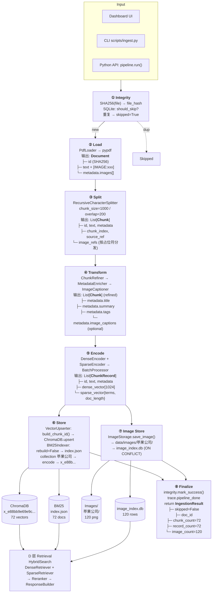
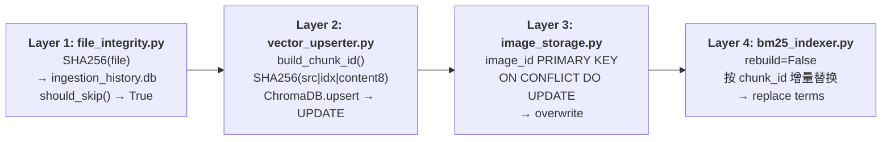
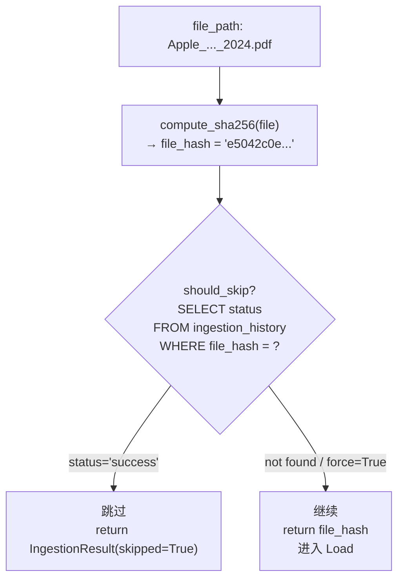
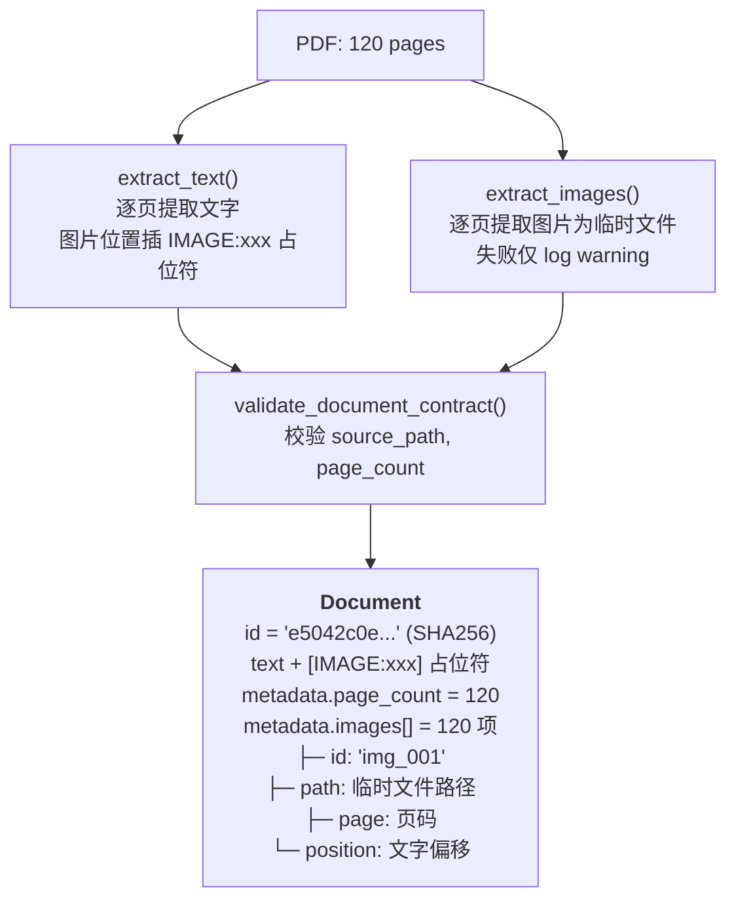
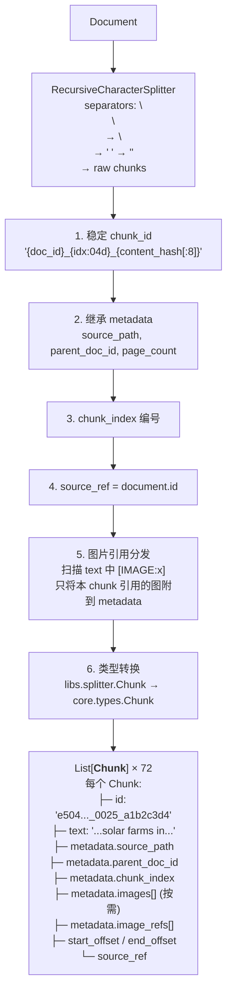
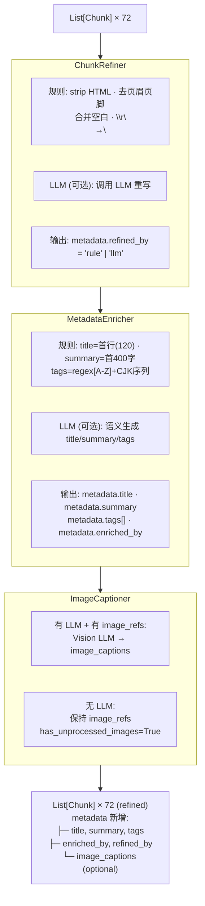
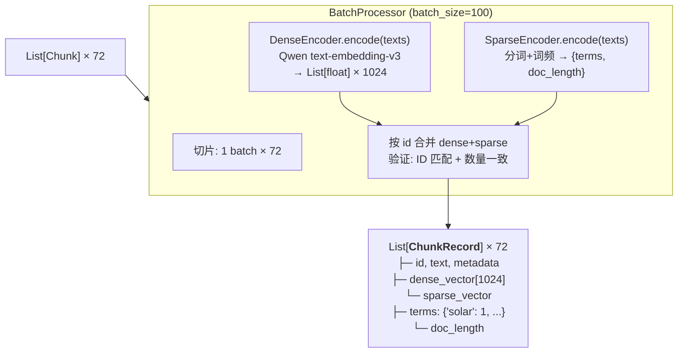
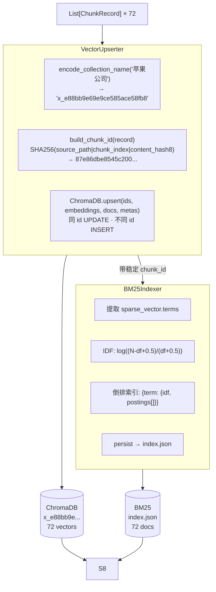
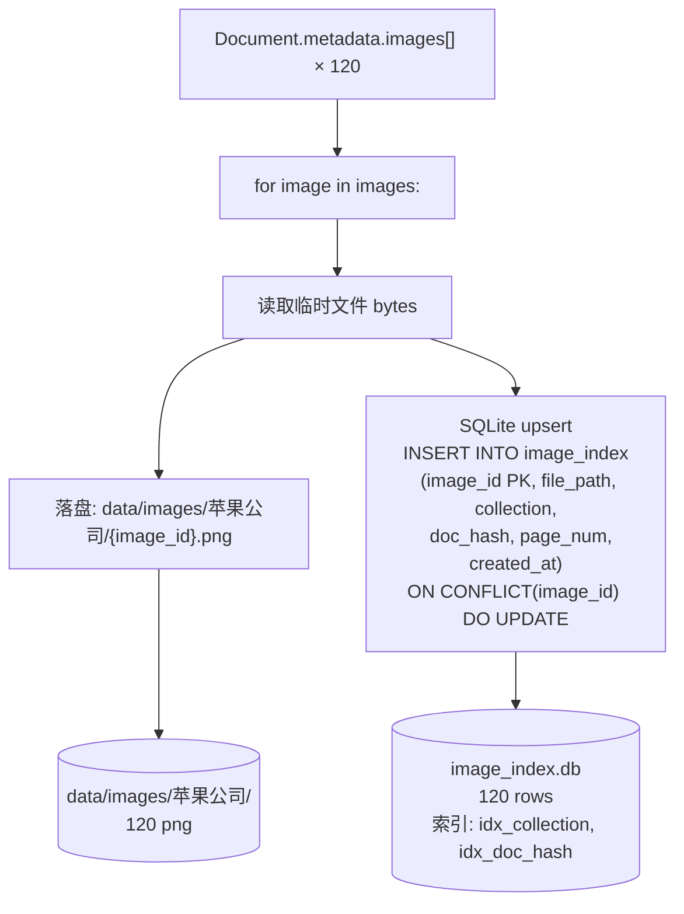
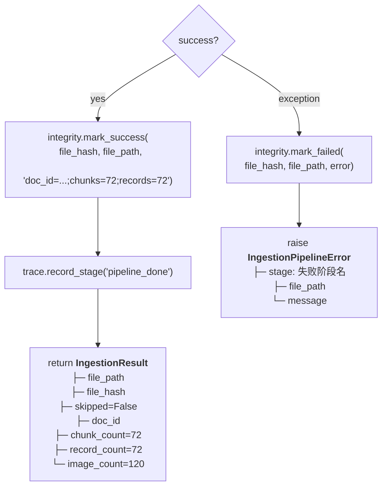

# IngestionPipeline 流水线架构

> 以 Apple 环境进展报告为例，追踪 PDF 从上传到可检索的全过程。

## 1. 总体架构

### 1.1 系统位置

IngestionPipeline 位于 **数据加工层**，向上承接文件上传入口，向下产出三类可检索资源。



### 1.2 示例：Apple 环境报告

| 参数 | 值 |
|------|-----|
| 文件 | `Apple_Environmental_Progress_Report_2024.pdf` |
| 存入分类 | `苹果公司` |
| 文件规模 | 120 页，含 120 张图片 |
| 处理结果 | 切分为 72 个文本片段，全部存入向量库和关键词索引 |

### 1.3 数据流转总览

| 阶段 | 输入 | 输出 | 关键操作 |
|------|------|------|---------|
| ① Integrity | `file_path` | `file_hash` | `SHA256()` → `should_skip()` |
| ② Load | `file_path` | `Document` | `PdfLoader.load()` → `text` + `metadata.images[]` |
| ③ Split | `Document` | `List[Chunk]` | `RecursiveSplitter` + `DocumentChunker` → 稳定 `chunk_id` |
| ④ Transform | `List[Chunk]` | `List[Chunk]` | ChunkRefiner → MetadataEnricher → ImageCaptioner |
| ⑤ Encode | `List[Chunk]` | `List[ChunkRecord]` | DenseEncoder + SparseEncoder → `dense_vector` + `sparse_vector` |
| ⑥ Store | `List[ChunkRecord]` | ChromaDB + BM25 | `VectorUpserter.upsert()` + `BM25Indexer.build()` |
| ⑦ Image | `Document.metadata.images[]` | disk + SQLite | `ImageStorage.save_image()` → `ON CONFLICT UPDATE` |
| ⑧ Finalize | pipeline result | `IngestionResult` | `mark_success()` → `ingestion_history` |

### 1.4 存储产物

```
data/
├── db/
│   ├── chroma/                  ← ChromaDB: 向量集合 (collection = x_e88b...)
│   ├── bm25/index.json          ← BM25Indexer: 倒排索引 {term: {idf, postings[]}}
│   ├── image_index.db            ← ImageStorage: image_id PK, file_path, doc_hash, collection
│   └── ingestion_history.db      ← IntegrityChecker: file_hash PK, file_path, status, processed_at
├── images/
│   └── 苹果公司/                  ← 图片文件 (原始 collection 名)
│       └── {image_id}.png
└── logs/
    └── traces.jsonl              ← TraceContext 追踪日志
```

### 1.5 重复处理防护（四层幂等）

同一文件反复上传不会产生重复数据：



| 层 | 文件 | 机制 | 效果 |
|----|------|------|------|
| 文件级 | file_integrity.py | `should_skip(file_hash)` 查 `ingestion_history.db` | 同文件跳过 pipeline |
| 向量级 | vector_upserter.py | `build_chunk_id()` 确定性 + `ChromaDB.upsert` | 同 chunk_id → UPDATE |
| 图片级 | image_storage.py | `image_id PK` + `ON CONFLICT DO UPDATE` | 同 image_id → 覆盖 |
| BM25 级 | bm25_indexer.py | `rebuild=False` 按 `chunk_id` 覆盖 | 同 id → 替换词项 |

## 2. 分阶段详解

### 2.1 ① Integrity — SHA256 文件校验

流程：计算文件指纹 → 查历史库 → 决定是否跳过。



- 数据表：`ingestion_history(file_hash PK, file_path, status, processed_at, error_msg)`
- `force=True` 可绕过跳过

**苹果文件**：首次上传，hash 不在库中 → 继续。

---

### 2.2 ② Load — PDF → Document

PdfLoader 调用 pypdf，逐页解析 PDF。



**苹果文件**：120 页文字 + 120 张图 → 1 个 Document。

---

### 2.3 ③ Split — Document → List[Chunk]

RecursiveCharacterSplitter 按 chunk_size=1000, overlap=200 切分，DocumentChunker 做适配。



**苹果文件**：~72 个 Chunk，含图片占位符的 Chunk 绑定了对应 `metadata.images[]`。

---

### 2.4 ④ Transform — ChunkRefiner → MetadataEnricher → ImageCaptioner

三次级联，每个遵循"规则兜底 + LLM 增强 + 降级标记"。



**苹果文件**：`use_llm: false`，只走规则路径。

---

### 2.5 ⑤ Encode — List[Chunk] → List[ChunkRecord]

BatchProcessor 将 Chunk 转为带向量的 ChunkRecord。



**苹果文件**：72 < 100 → 1 批处理完。

---

### 2.6 ⑥ Store — ChromaDB + BM25 双重持久化



**VectorUpserter must run before BM25**: 前者是 chunk_id 的权威来源（C12），BM25 接收相同 ID 保持命名空间一致。

---

### 2.7 ⑦ Image Store — 图片独立落盘

图片是文档级资源，独立于 Chunk 存储。



**苹果文件**：120 张图落盘 + 120 条 SQLite。

---

### 2.8 ⑧ Finalize — 标记完成



**成功处理结果**：

```python
结果 = {
    "文件": "Apple_Environmental_Progress_Report_2024.pdf",
    "状态": "成功",
    "片段数": 72,
    "图片数": 120,
    "文档ID": "e5042c..."
}
```

---

## 3. 如何使用

### 页面操作

在 Dashboard 的 "Upload & Ingest" 页面：
1. 选择 PDF 文件
2. 填写集合名（如 `苹果公司`）
3. 点击开始
4. 实时进度条显示当前阶段
5. 完成后显示片段数和图片数

### 命令行

```bash
# 单个文件
python scripts/ingest.py --path docs/Apple.pdf --collection 苹果公司

# 整个目录
python scripts/ingest.py --path docs/ --collection knowledge_hub

# 强制重新处理
python scripts/ingest.py --path docs/Apple.pdf --force
```

### 代码调用

```python
from ingestion import IngestionPipeline
from core.settings import load_settings

pipeline = IngestionPipeline(load_settings())
result = pipeline.run("file.pdf", collection="my_collection")

# → IngestionResult:
#   result.skipped       # bool
#   result.doc_id        # Document.id (SHA256)
#   result.chunk_count   # len(List[Chunk])
#   result.record_count  # len(List[ChunkRecord])
#   result.image_count   # len(metadata.images[])
```

---

## 4. 关键文件

| 文件 | 作用 |
|------|------|
| [pipeline.py](src/ingestion/pipeline.py) | 流水线总控 |
| [document_chunker.py](src/ingestion/chunking/document_chunker.py) | 智能切片 |
| [chunk_refiner.py](src/ingestion/transform/chunk_refiner.py) | 文本清洗 |
| [metadata_enricher.py](src/ingestion/transform/metadata_enricher.py) | 标题/摘要/标签生成 |
| [batch_processor.py](src/ingestion/embedding/batch_processor.py) | 向量编码 |
| [vector_upserter.py](src/ingestion/storage/vector_upserter.py) | 向量存储 |
| [bm25_indexer.py](src/ingestion/storage/bm25_indexer.py) | 关键词索引 |
| [image_storage.py](src/ingestion/storage/image_storage.py) | 图片归档 |
| [document_manager.py](src/ingestion/document_manager.py) | 文档管理 |
| [pdf_loader.py](src/libs/loader/pdf_loader.py) | PDF 解析 |
| [file_integrity.py](src/libs/loader/file_integrity.py) | 文件去重 |
| [chroma_store.py](src/libs/vector_store/chroma_store.py) | 向量库 + 集合名编解码 |
| [settings.yaml](config/settings.yaml) | 全部配置 |

---

## 5. 配置速查

```yaml
ingestion:
  chunk_size: 1000          # 每个片段最大字符数
  chunk_overlap: 200        # 片段间重叠字符数
  splitter: "recursive"     # 切分策略
  batch_size: 100           # 编码批大小

embedding:
  provider: "qwen"
  model: "text-embedding-v3"
  dimensions: 1024          # 向量维度

vector_store:
  collection_name: "knowledge_hub"  # 默认集合名
```
