# IngestionPipeline 流水线架构

> 以 Apple 环境进展报告为例，追踪 PDF 从上传到可检索的全过程。

## 1. 总体架构

### 1.1 系统位置

IngestionPipeline 位于 **数据加工层**，向上承接文件上传入口，向下产出三类可检索资源。

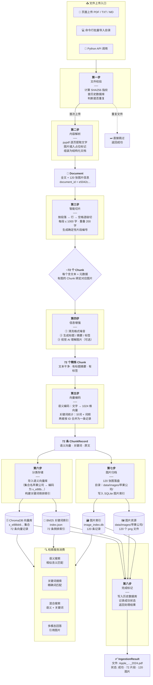

### 1.2 示例：Apple 环境报告

| 参数 | 值 |
|------|-----|
| 文件 | `Apple_Environmental_Progress_Report_2024.pdf` |
| 存入分类 | `苹果公司` |
| 文件规模 | 120 页，含 120 张图片 |
| 处理结果 | 切分为 72 个文本片段，全部存入向量库和关键词索引 |

### 1.3 流水线全貌

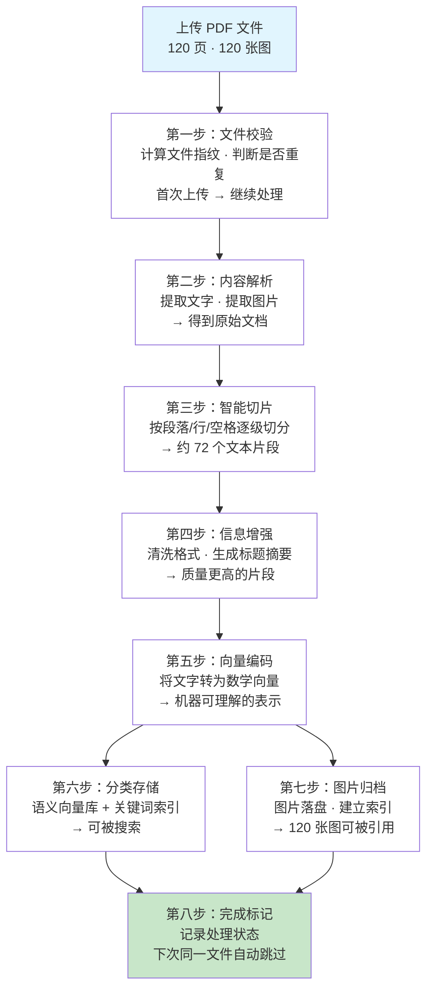

### 1.4 处理后的产物

```
data/
├── db/
│   ├── chroma/              ← 语义向量（机器搜索用）
│   ├── bm25/index.json      ← 关键词索引（关键词搜索用）
│   ├── image_index.db        ← 图片索引（找图用）
│   └── ingestion_history.db  ← 处理记录（避免重复处理）
├── images/
│   └── 苹果公司/             ← 图片原文件
└── logs/
    └── traces.jsonl          ← 处理日志
```

### 1.5 重复处理防护（四层幂等）

同一文件反复上传不会产生重复数据：

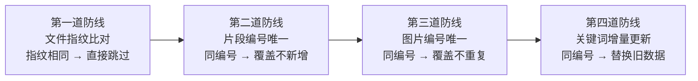

| 防线 | 判断依据 | 效果 |
|------|---------|------|
| 文件级 | SHA256 文件指纹 | 同文件不重复处理 |
| 向量级 | 确定性片段编号 | 同片段覆盖写入 |
| 图片级 | 图片唯一主键 | 同图片覆盖不重复 |
| 关键词级 | 按片段编号增量 | 同编号替换旧词条 |

## 2. 分阶段详解

### 2.1 第一步：文件校验

拿到 PDF 后，先算一个"文件指纹"（SHA256），去数据库里查：这个文件处理过没？

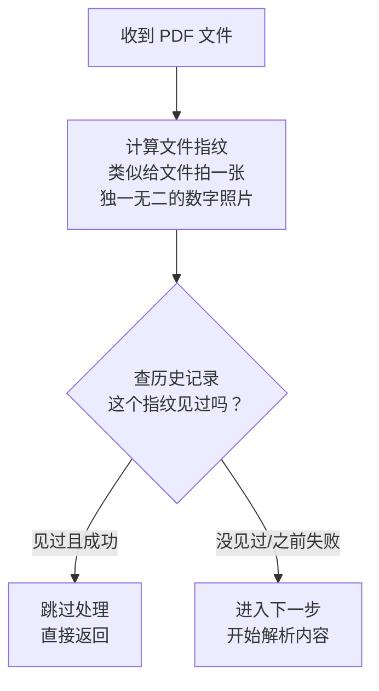

**苹果文件**：首次上传，指纹不在历史中 → 继续。

---

### 2.2 第二步：内容解析

把 PDF 变成程序能理解的格式。

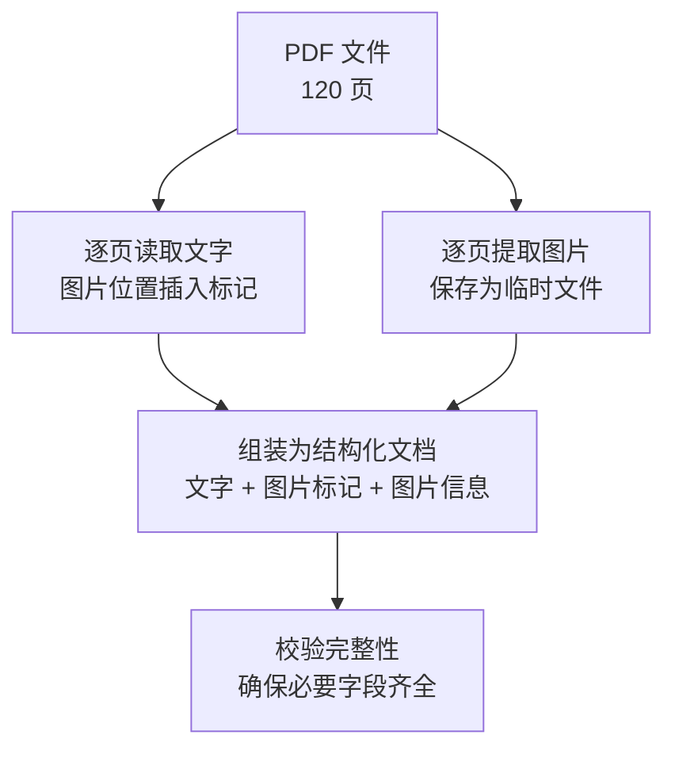

**产出**：一个结构化文档对象，包含：
- 全文文本（图片处有 `[IMAGE: 编号]` 标记）
- 120 张图片的信息（编号、位置、所在页码）

**苹果文件**：120 页全部提取成功。

---

### 2.3 第三步：智能切片

一整本书太长，切成小段才好搜索。

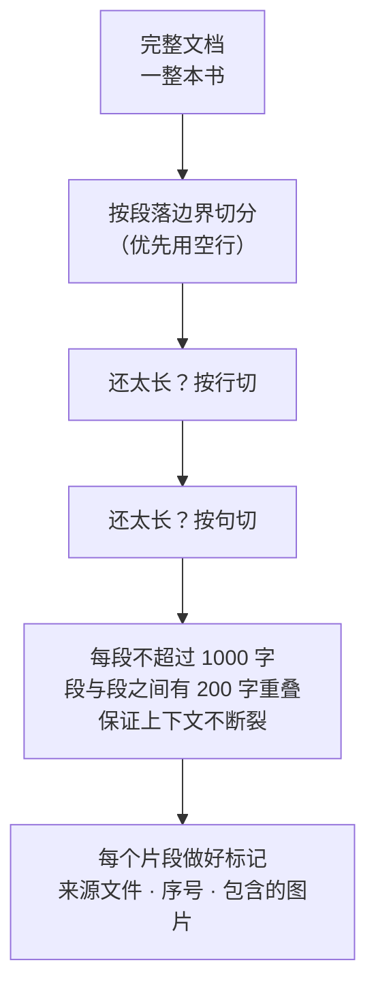

**额外处理**：
- 每个片段生成唯一编号，同一文件永远产生同样编号
- 检测每个片段里有没有图片标记，有就把对应图片信息附上

**苹果文件**：120 页 → 约 **72 个片段**。

---

### 2.4 第四步：信息增强

原始切出来的片段比较粗糙，做三道加工。

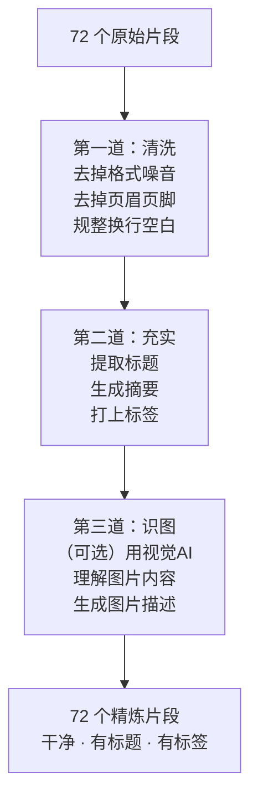

**第一道 — 清洗**：
- 去除 PDF 提取时产生的格式垃圾（HTML 标签、多余空白等）
- 可选择调用大模型进一步润色（生产环境通常关闭）

**第二道 — 充实**：
- 标题：取片段第一行
- 摘要：取片段前 400 字
- 标签：自动提取关键词（如 `environmental`, `report`, `apple`）

**第三道 — 识图**（可选）：
- 如有图片且开启了视觉 AI，自动生成图片描述

**苹果文件**：当前设置未开启 AI 增强，只做规则清洗和自动标签。

---

### 2.5 第五步：向量编码

把人类文字转成数学向量，机器才能做语义搜索。

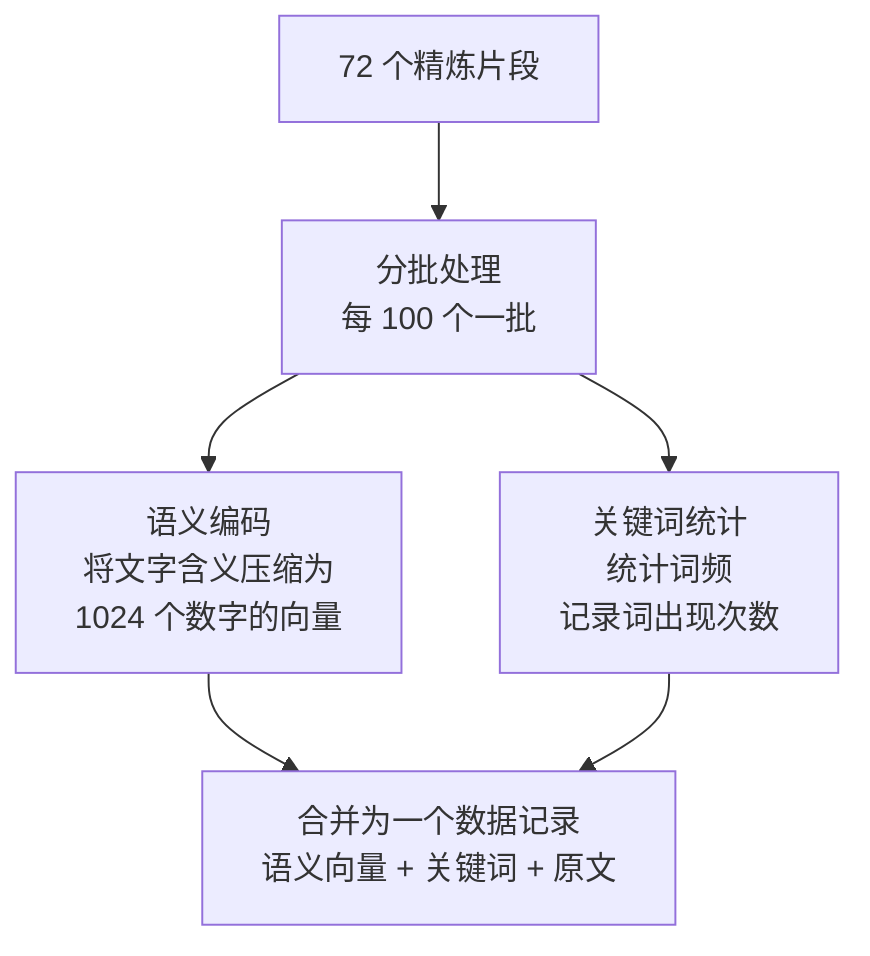

**通俗理解**：语义向量就像一个"意义地图"，意思相近的句子在地图上挨得近。

**苹果文件**：72 个片段 < 100 → 一批处理完。

---

### 2.6 第六步：分类存储

将向量和关键词分别存入两个库。

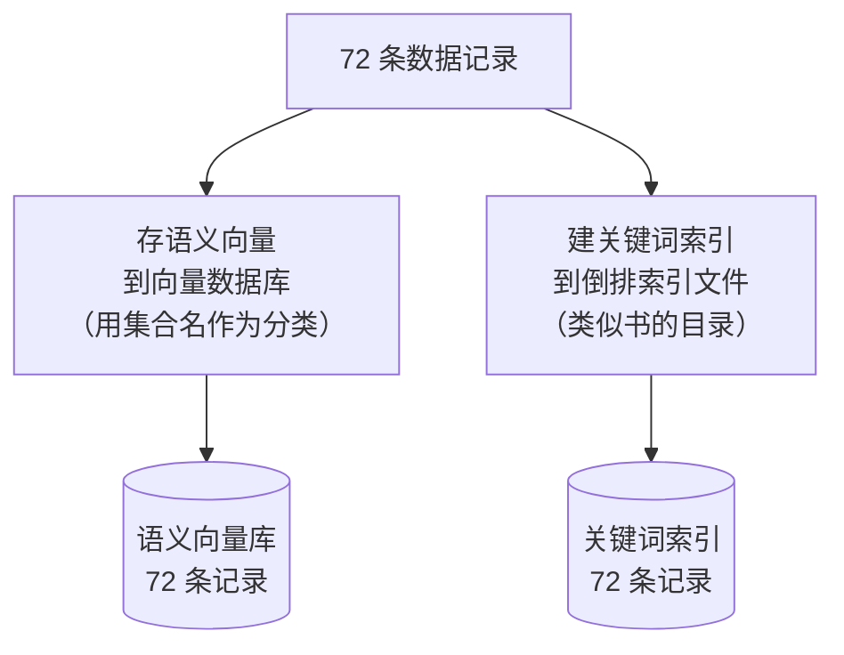

**关于"集合名"（Collection）**：

用户上传时填的集合名（如 `苹果公司`）就是分类标签。由于向量数据库只支持英文命名，中文名会被自动编码：

```
用户填：苹果公司
   ↓ 编码
向量库存：x_e88bb9e69e9c...
   ↓ 解码（显示时）
页面显示：苹果公司
```

这个编解码过程对用户完全透明，页面始终显示中文名。

**苹果文件**：72 条记录全部存入 `苹果公司` 分类。

---

### 2.7 第七步：图片归档

图片单独存储，不跟文本混在一起。

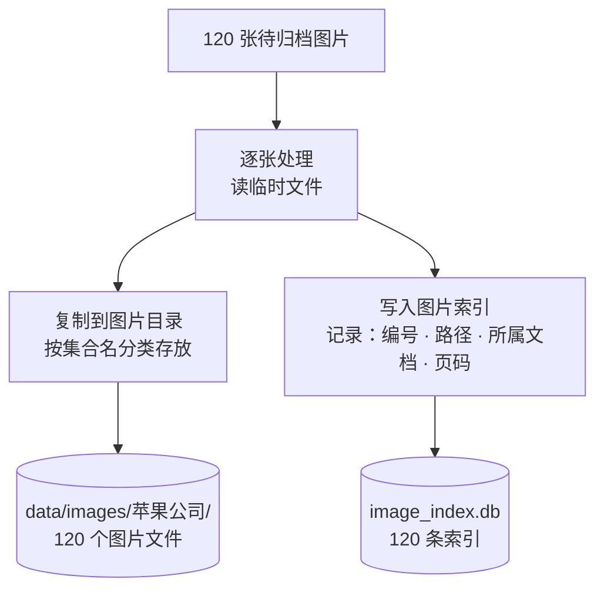

**为什么分开存**：一个图片可能被多个片段引用，分开管理更方便删除和迁移。

**苹果文件**：120 张图全部归档。

---

### 2.8 第八步：完成标记

记录处理结果，确保下次不重复劳动。

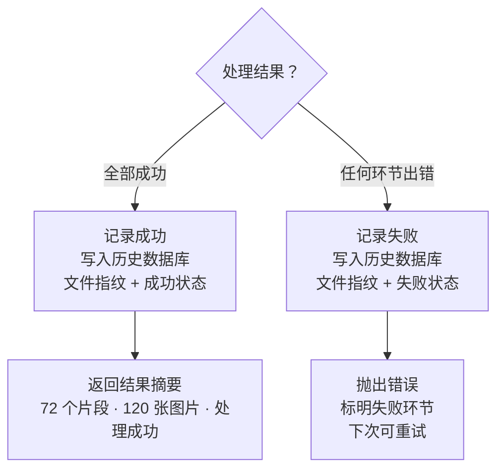

**成功处理结果**：

```python
结果 = {
    "文件": "Apple_Environmental_Progress_Report_2024.pdf",
    "状态": "成功",
    "片段数": 72,
    "图片数": 120,
    "文档ID": "e5042c..."
}
```

---

## 3. 如何使用

### 页面操作

在 Dashboard 的 "Upload & Ingest" 页面：
1. 选择 PDF 文件
2. 填写集合名（如 `苹果公司`）
3. 点击开始
4. 实时进度条显示当前阶段
5. 完成后显示片段数和图片数

### 命令行

```bash
# 单个文件
python scripts/ingest.py --path docs/Apple.pdf --collection 苹果公司

# 整个目录
python scripts/ingest.py --path docs/ --collection knowledge_hub

# 强制重新处理
python scripts/ingest.py --path docs/Apple.pdf --force
```

### 代码调用

```python
from ingestion import IngestionPipeline
from core.settings import load_settings

pipeline = IngestionPipeline(load_settings())
result = pipeline.run("file.pdf", collection="my_collection")
print(f"片段: {result.chunk_count}, 图片: {result.image_count}")
```

---

## 4. 关键文件

| 文件 | 作用 |
|------|------|
| [pipeline.py](src/ingestion/pipeline.py) | 流水线总控 |
| [document_chunker.py](src/ingestion/chunking/document_chunker.py) | 智能切片 |
| [chunk_refiner.py](src/ingestion/transform/chunk_refiner.py) | 文本清洗 |
| [metadata_enricher.py](src/ingestion/transform/metadata_enricher.py) | 标题/摘要/标签生成 |
| [batch_processor.py](src/ingestion/embedding/batch_processor.py) | 向量编码 |
| [vector_upserter.py](src/ingestion/storage/vector_upserter.py) | 向量存储 |
| [bm25_indexer.py](src/ingestion/storage/bm25_indexer.py) | 关键词索引 |
| [image_storage.py](src/ingestion/storage/image_storage.py) | 图片归档 |
| [document_manager.py](src/ingestion/document_manager.py) | 文档管理 |
| [pdf_loader.py](src/libs/loader/pdf_loader.py) | PDF 解析 |
| [file_integrity.py](src/libs/loader/file_integrity.py) | 文件去重 |
| [chroma_store.py](src/libs/vector_store/chroma_store.py) | 向量库 + 集合名编解码 |
| [settings.yaml](config/settings.yaml) | 全部配置 |

---

## 5. 配置速查

```yaml
ingestion:
  chunk_size: 1000          # 每个片段最大字符数
  chunk_overlap: 200        # 片段间重叠字符数
  splitter: "recursive"     # 切分策略
  batch_size: 100           # 编码批大小

embedding:
  provider: "qwen"
  model: "text-embedding-v3"
  dimensions: 1024          # 向量维度

vector_store:
  collection_name: "knowledge_hub"  # 默认集合名
```
