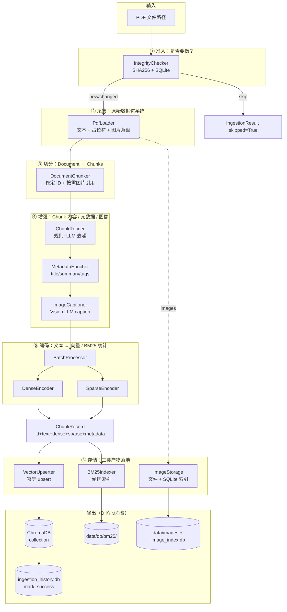

# C 阶段（Ingestion Pipeline）：数据流、模块协作与编排全景

本文档对应 `DEV_SPEC.md` 第 6 节中的 **阶段 C：Ingestion Pipeline MVP（C1–C15）**，也是 `src/ingestion/` 目录的实现说明。
读完本文你应该能回答：

- C 阶段在整体架构里**承担什么**？它和 B 层 / Core / MCP 是什么关系？
-  **数据**？
- 每个模块的**输入输出契约**、**降级策略**、**幂等保证**长什么样？
- 失败、重跑、跨集合（collection）这些边界情况是怎么处理的？

---

## 1. C 阶段在项目里扮演什么角色？


| 层次                         | 角色                                                                   | 与 C 阶段的关系                                            |
| -------------------------- | -------------------------------------------------------------------- | ---------------------------------------------------- |
| **B 层 Libs**（`src/libs/`*） | 提供可插拔能力（Embedding / Splitter / VectorStore / Loader / LLM / Vision）。 | C 阶段是 **B 层的“最大消费者”**，所有真实 IO 都通过 B 层工厂调用。           |
| **C 阶段 Ingestion**（本层）     | **离线数据流**的端到端编排：原始文件 → 可检索的索引产物。                                     | 串起 B 层组件，负责**业务对象转换**、**幂等性**、**降级**、**多产物落地**。      |
| **D 阶段 Retrieval**         | 在线查询：Query → 候选 → 排序。                                                | C 阶段产出的 ChromaDB / BM25 索引 / 图片索引，**就是 D 阶段读取的数据源**。 |
| **MCP / Dashboard**        | 对外暴露 tools / 可视化。                                                    | 只读消费 C 阶段写入的数据。                                      |


> 一句话：**B 是“能做什么”，C 是“按顺序把它们做了”。**

C 阶段对外（Core / 脚本 / Dashboard）只暴露三个东西：

1. `IngestionPipeline.run(file_path, collection?, force?)` —— 一个文件的完整摄取闭环。
2. `IngestionResult` —— 结构化结果（doc_id / chunk_count / record_count / image_count / skipped）。
3. `IngestionPipelineError(stage, file_path, message)` —— 带阶段上下文的失败信号。

---

## 2. 子模块一览（与 `src/ingestion/` 目录一一对应）


| 子目录 / 文件                                  | 对应任务 | 职责                                                                            | 关键产物                                                   |
| ----------------------------------------- | ---- | ----------------------------------------------------------------------------- | ------------------------------------------------------ |
| `libs/loader/file_integrity.py` *(B 层提供)* | C2   | SHA256 + SQLite(WAL) 摄取历史，决定是否跳过 / 重跑。                                        | `data/db/ingestion_history.db`                         |
| `libs/loader/pdf_loader.py` *(B 层提供)*     | C3   | PDF → `Document`，提取图片到 `data/images/{doc_hash}/` 并在文本中写入 `[IMAGE: {id}]` 占位符。 | `Document(text, metadata.images)`                      |
| `chunking/document_chunker.py`            | C4   | **业务适配器**：`Document` → `List[Chunk]`，生成稳定 chunk_id、按需分发图片引用、继承元数据。            | `List[Chunk]`                                          |
| `transform/base_transform.py`             | C5   | `BaseTransform` 抽象。                                                           | —                                                      |
| `transform/chunk_refiner.py`              | C5   | 规则去噪 + 可选 LLM 精炼，失败回退规则，写 `metadata.refined_by`。                              | 干净的 `Chunk.text`                                       |
| `transform/metadata_enricher.py`          | C6   | 规则 + 可选 LLM，写 `metadata.title / summary / tags`。                              | 富元数据                                                   |
| `transform/image_captioner.py`            | C7   | 命中 `image_refs` 时调 Vision LLM 生成 caption；失败标 `has_unprocessed_images`，不阻塞。    | `metadata.image_captions`                              |
| `embedding/dense_encoder.py`              | C8   | 调 `BaseEmbedding.embed(texts)` 批量算稠密向量。                                       | `dense_vector`                                         |
| `embedding/sparse_encoder.py`             | C9   | 计算 BM25 所需的 `term_freq` / `doc_length` 等统计。                                   | `sparse_vector`                                        |
| `embedding/batch_processor.py`            | C10  | 编排 dense + sparse 批处理，把 `Chunk` 装配成 `ChunkRecord`。                            | `List[ChunkRecord]`                                    |
| `storage/bm25_indexer.py`                 | C11  | 倒排索引构建（IDF + postings）+ 文件持久化 + 增量更新 / 重建。                                    | `data/db/bm25/`                                        |
| `storage/vector_upserter.py`              | C12  | 稳定 chunk_id（hash 路径+index+content）+ 幂等 `BaseVectorStore.upsert`。              | ChromaDB collection                                    |
| `storage/image_storage.py`                | C13  | 图片落盘 + SQLite(WAL) 索引（`image_id → path / collection / page`）。                 | `data/images/{collection}/` + `data/db/image_index.db` |
| `pipeline.py`                             | C14  | 串行编排 7 个阶段 + TraceContext 打点 + 失败标记。                                          | `IngestionResult`                                      |
| `scripts/ingest.py`                       | C15  | CLI 入口：`--path / --collection / --force / --settings`。                        | 命令行批处理                                                 |


---

## 3. 端到端数据流（一图看懂）




---

## 4. 阶段详解（Pipeline 7 段式）

`IngestionPipeline.run()` 严格按下表顺序串行执行。每一段都会通过 `TraceContext.record_stage(name, **fields)` 写一条 trace（为 F 阶段做铺垫）。

### 阶段 ① integrity —— 是否需要做？

- **输入**：`file_path`（绝对路径）、`force`。
- **行为**：
  1. `compute_sha256(file_path)` 得到 `file_hash`；
  2. 若 `force=False` 且 `should_skip(file_hash) == True`（历史表里已 `success`），整个流程**短路**返回 `IngestionResult(skipped=True)`；
  3. 否则继续，并把 `file_hash` 带到后续阶段以便最终 `mark_success / mark_failed`。
- **存储**：`data/db/ingestion_history.db`（SQLite WAL，并发安全）。
- **意义**：让 ingest 是**可重入**的——同一份未变文件多次运行不会重复消耗 LLM / 写入索引。

### 阶段 ② load —— 文件 → Document

- **实现**：`PdfLoader.load(path) -> Document`（B 层）。
- **关键契约**（C1 定义）：
  - `Document.text`：纯文本 + `[IMAGE: {image_id}]` 占位符；
  - `Document.metadata["source_path"]`：必填；
  - `Document.metadata["images"]`：`List[ImageRef]`，每个含 `id / path / page / text_offset / text_length / position`。
- **降级**：图片提取失败只记录警告，**不阻塞文本解析**。

### 阶段 ③ split —— Document → List[Chunk]

`DocumentChunker` 是 `**libs.splitter` 的业务适配器**，相比纯文本切分器额外承担 6 件事：

1. **稳定 chunk_id**：`{doc_id}_{index:04d}_{content_hash[:8]}` —— 同 Document 重复切分得到同序列。
2. **元数据继承**：复制 `Document.metadata` 到每个 `Chunk.metadata`。
3. **chunk_index**：写入 `metadata.chunk_index`，支持排序 / 定位。
4. **source_ref**：每个 `Chunk.source_ref = document.id`，支持溯源。
5. **图片引用按需分发**（最关键的非平凡逻辑）：扫描每个 chunk 文本中的 `[IMAGE: id]` 占位符，从 `Document.metadata["images"]` 中**抽取该 chunk 实际命中的子集**写入 `chunk.metadata["images"]`，并在 `metadata["image_refs"]` 写入 `image_id` 列表；**没有占位符的 chunk 不会带上 `images` 字段**。
6. **类型转换**：`List[str]` → `List[Chunk]`，符合 `core/types.py` 契约。

> ⚠️ **为什么不能整体继承 `images`**：C7 ImageCaptioner 是按 `chunk` 粒度调 Vision LLM 的，错误的继承会让无图 chunk 也去跑 caption，浪费 LLM 调用且引入语义噪声。

### 阶段 ④ transform —— 三个串行变换

Pipeline 默认装配（按顺序）：

```
ChunkRefiner -> MetadataEnricher -> ImageCaptioner
```

每个 transform 都遵循 `BaseTransform.transform(chunks, trace) -> List[Chunk]`，且都内置**“规则兜底 + LLM 增强 + 失败降级 + metadata 标注”**四件套：


| Transform                 | 规则路径                        | LLM 路径                                           | 降级策略                                                                             |
| ------------------------- | --------------------------- | ------------------------------------------------ | -------------------------------------------------------------------------------- |
| **ChunkRefiner** (C5)     | 去空白 / 页眉页脚 / 格式标记 / HTML 注释 | 读 `config/prompts/chunk_refinement.txt` 调 LLM 重写 | LLM 失败 → 用规则结果，`metadata.refined_by="rule"` 并标 fallback 原因；单 chunk 异常不影响其它 chunk |
| **MetadataEnricher** (C6) | 兜底 title/summary/tags（保证非空） | 读 `metadata_enrichment` prompt 调 LLM 输出语义化字段     | LLM 失败 → 规则结果 + 标记降级原因                                                           |
| **ImageCaptioner** (C7)   | 不调 LLM 时跳过                  | 命中 `image_refs` 时调 Vision LLM                    | 失败 / 未配置 → 保留 `image_refs`，写 `metadata.has_unprocessed_images=True`              |


> Pipeline 在每个 transform 之间额外调用 `trace.record_stage("transform_step", transform=<class_name>, chunk_count=...)`，方便 Dashboard 显示瀑布图。

### 阶段 ⑤ encode —— Chunks → ChunkRecords

`BatchProcessor.process(chunks)` 是**编码层的总指挥**：

```
chunks
  ├── DenseEncoder  → 调 libs.embedding.embed(batch_texts) → List[List[float]]
  └── SparseEncoder → 计算 term_freq / doc_length / 词表
                ↓
       组装成 ChunkRecord(id, text, metadata, dense_vector, sparse_vector)
```

- **批大小**由 `settings.ingestion.batch_size` 决定，5 chunks + batch=2 → 3 批，**顺序稳定**。
- 出口是 `List[ChunkRecord]` —— **唯一被存储层消费的中间结构**。

### 阶段 ⑥ store —— 三类产物落地

存储阶段做**两件事**（图片走单独路径）：

```python
self._bm25_indexer.build(records, rebuild=False, persist=True)
upserted = self._vector_upserter.upsert(records, trace=trace)
```

- **VectorUpserter**：基于稳定 chunk_id 调 `BaseVectorStore.upsert(records)`。
  - **幂等性**：同内容重复跑，id 不变 → ChromaDB 内是 update，不会重复写。
  - **变更感知**：内容改变 → content_hash 变 → id 变 → 视为新 chunk（旧 chunk 由 G2 `DocumentManager.delete_document` 协调清理）。
- **BM25Indexer**：
  - 计算 `IDF(term) = log((N - df + 0.5) / (df + 0.5))`；
  - 持久化倒排表 `{term: {idf, postings: [{chunk_id, tf, doc_length}]}}` 到 `data/db/bm25/`；
  - 支持 `rebuild=True` 全量重建 / `rebuild=False` 增量更新。

### 阶段 ⑦ image_store —— 文档级图片落盘

由 `_stage_store_images(document, collection, trace)` 单独完成（不挂在 chunk record 上）：

- 遍历 `document.metadata["images"]`；
- 把 PdfLoader 临时落地的图片读成 bytes，调用 `ImageStorage.save_image(image_id, bytes, collection, doc_hash, page_num, extension)`；
- ImageStorage 同时写入 SQLite 索引表 `image_index(image_id PK, file_path, collection, doc_hash, page_num, created_at)`；
- 索引建立 `idx_collection / idx_doc_hash` 两个索引，支持 **按集合 / 按文档** 批量查询（D 阶段 / E6 多模态返回会用）。

> **为什么图片存储独立于 chunk 存储**：图片是文档级资源，可能被多个 chunk 的 caption 引用；分开存储让“按 collection 删除 / 列出 / 迁移”都更干净。

### 阶段 ⑧ 收尾 —— mark_success + 汇总

成功路径上：

```python
integrity_checker.mark_success(file_hash, file_path, message="doc_id=…;chunks=…;records=…")
trace.record_stage("pipeline_done", file_path, doc_id, chunk_count, record_count, image_count)
return IngestionResult(...)
```

任意阶段抛异常 → `IngestionPipelineError(stage, file_path, msg)` → `mark_failed(file_hash, file_path, error_msg)` → 异常向上抛给 CLI / Pipeline 调用方。

---

## 5. 数据契约（贯穿整个 C 阶段）

```python
# src/core/types.py
Document(id, text, metadata)
Chunk(id, text, metadata, start_offset, end_offset, source_ref)
ChunkRecord(id, text, metadata, dense_vector?, sparse_vector?)
```

`**metadata.images` ImageRef 规范**（C1）：

```json
{
  "id": "{doc_hash}_{page}_{seq}",
  "path": "data/images/{collection}/{image_id}.png",
  "page": 3,
  "text_offset": 1024,
  "text_length": 22,
  "position": { "x": 100, "y": 200, "w": 480, "h": 320 }
}
```

**文本占位符规范**：`[IMAGE: {image_id}]`（DocumentChunker 据此分发图片引用）。

**Pipeline 阶段名（trace.stage）速查**：
`integrity / load / split / transform / transform_step / encode / store / image_store / pipeline_done`

---

## 6. 配置如何驱动 C 阶段

C 阶段不读环境变量、不硬编码 provider，所有可变行为都来自 `Settings`（`config/settings.yaml`）：


| 配置项                                                           | 影响的模块                                     |
| ------------------------------------------------------------- | ----------------------------------------- |
| `ingestion.splitter.strategy / chunk_size / chunk_overlap`    | `DocumentChunker` 通过 `SplitterFactory` 路由 |
| `ingestion.chunk_refiner.use_llm` + `llm.`*                   | `ChunkRefiner` 决定走规则还是规则+LLM              |
| `ingestion.metadata_enricher.use_llm`                         | `MetadataEnricher` 同上                     |
| `ingestion.image_captioner.enabled` + `vision_llm.*`          | `ImageCaptioner` 是否调 Vision               |
| `ingestion.batch_size`                                        | `BatchProcessor` 批大小                      |
| `embedding.provider / model`                                  | `DenseEncoder` 通过 `EmbeddingFactory`      |
| `vector_store.provider / collection_name / persist_directory` | `VectorUpserter` 通过 `VectorStoreFactory`  |


**心智模型**：Pipeline 构造函数读一次 `Settings`，把每个子域的 `XxxSettings` 交给对应工厂，运行时只调 Base 接口 —— 与 B_LAYER 描述完全一致。

---

## 7. 错误处理 / 幂等 / 降级策略汇总


| 关注点      | 设计                                                                                                      |
| -------- | ------------------------------------------------------------------------------------------------------- |
| **重跑安全** | 集成 SHA256 + ingestion_history → 同文件未改不重做；chunk_id 稳定 → 向量库 upsert 幂等。                                   |
| **失败定位** | `IngestionPipelineError(stage, file_path, msg)` 直接告诉你哪一段炸了。                                             |
| **失败标记** | 任何阶段异常都会调 `mark_failed`，避免“失败状态被误标成 success”。                                                           |
| **不阻塞**  | ChunkRefiner / MetadataEnricher / ImageCaptioner 三个 LLM/Vision 模块**全部**遵循“失败降级 + metadata 标注 + 不抛致命异常”。 |
| **顺序稳定** | DocumentChunker 的 chunk_id、BatchProcessor 的批序、VectorUpserter 的 upsert 顺序均稳定 → 测试可断言、问题可复现。              |
| **可观测**  | 每阶段 `trace.record_stage(...)`，F 阶段接上 JSON Lines 即可在 Dashboard 看瀑布图。                                     |
| **依赖注入** | `IngestionPipeline.__init_`_ 所有依赖都是 keyword-only 的可选参数 → 单元测试用 Fake 注入，无需真实 LLM。                        |


---

## 8. CLI 入口（C15）

```bash
python scripts/ingest.py --path tests/fixtures/sample_documents/ --collection my_kb
python scripts/ingest.py --path /abs/path/to/one.pdf --force
python scripts/ingest.py --path docs/ --settings config/settings.dev.yaml
```

`scripts/ingest.py` 行为：

1. 解析 `--path`：文件 → 单文件；目录 → 递归扫描所有 `*.pdf`（按字典序，结果稳定）。
2. `load_settings(args.settings or None)`，失败 fail-fast。
3. 构造**单例** `IngestionPipeline(settings)`，对每个 PDF 调 `pipeline.run(...)`。
4. 控制台输出 `OK / SKIP / FAILED` 三态 + 末尾 `summary total=… processed=… skipped=… failed=…`。
5. 退出码：有任何 failed → `1`，否则 `0`（适合接 CI / cron）。

---

## 9. 与下游阶段的耦合点


| 下游                     | 读取的 C 产物                                         | 备注                                                |
| ---------------------- | ------------------------------------------------ | ------------------------------------------------- |
| **D2 DenseRetriever**  | ChromaDB collection                              | 通过 chunk_id / metadata 取回 chunk                   |
| **D3 SparseRetriever** | `data/db/bm25/` 倒排索引 + `ChromaStore.get_by_ids`  | BM25 给 id+score，向量库补 text+metadata                |
| **E6 多模态返回**           | `data/images/` + `image_index.db`                | 按 chunk metadata 中的 `image_refs` 反查 path → base64 |
| **G2 DocumentManager** | 全部四类存储（Chroma / BM25 / Image / IntegrityHistory） | 删除时四者必须同时清理，否则状态不一致                               |
| **F4 Trace 打点**        | Pipeline 内已有 `trace.record_stage(...)`           | F 阶段只需把 TraceContext 持久化到 `logs/traces.jsonl`     |


---

## 10. 阅读源码的推荐顺序

1. `src/core/types.py` —— 先认 **Document / Chunk / ChunkRecord** 三个数据结构。
2. `src/ingestion/pipeline.py` —— 顺着 7 个 `_stage_`* 方法把全流程读一遍。
3. `src/ingestion/chunking/document_chunker.py` —— 看“**业务适配器**”里那 6 件事是怎么落地的（尤其是图片引用按需分发）。
4. `src/ingestion/transform/*.py` —— 看“**规则 + LLM + 降级**”模板。
5. `src/ingestion/embedding/batch_processor.py` —— 看 dense/sparse 是怎么并轨成 `ChunkRecord` 的。
6. `src/ingestion/storage/{vector_upserter,bm25_indexer,image_storage}.py` —— 看三类产物的**幂等性 / 持久化 / 索引结构**。
7. `scripts/ingest.py` —— 把上面所有东西从命令行串起来。

---

## 11. 与 DEV_SPEC 任务编号的对应关系


| 任务                  | 文件                                                               | 状态  |
| ------------------- | ---------------------------------------------------------------- | --- |
| C1 数据契约             | `src/core/types.py`                                              | ✅   |
| C2 文件完整性            | `src/libs/loader/file_integrity.py`                              | ✅   |
| C3 PDF Loader       | `src/libs/loader/pdf_loader.py`                                  | ✅   |
| C4 DocumentChunker  | `src/ingestion/chunking/document_chunker.py`                     | ✅   |
| C5 ChunkRefiner     | `src/ingestion/transform/chunk_refiner.py` + `base_transform.py` | ✅   |
| C6 MetadataEnricher | `src/ingestion/transform/metadata_enricher.py`                   | ✅   |
| C7 ImageCaptioner   | `src/ingestion/transform/image_captioner.py`                     | ✅   |
| C8 DenseEncoder     | `src/ingestion/embedding/dense_encoder.py`                       | ✅   |
| C9 SparseEncoder    | `src/ingestion/embedding/sparse_encoder.py`                      | ✅   |
| C10 BatchProcessor  | `src/ingestion/embedding/batch_processor.py`                     | ✅   |
| C11 BM25Indexer     | `src/ingestion/storage/bm25_indexer.py`                          | ✅   |
| C12 VectorUpserter  | `src/ingestion/storage/vector_upserter.py`                       | ✅   |
| C13 ImageStorage    | `src/ingestion/storage/image_storage.py`                         | ✅   |
| C14 Pipeline 编排     | `src/ingestion/pipeline.py`                                      | ✅   |
| C15 CLI 入口          | `scripts/ingest.py`                                              | ✅   |


---

*本文档与当前 `src/ingestion/` 实现一一对齐；后续如果新增 transform 步骤或更换存储后端，请同步更新第 2、4、6 节。*