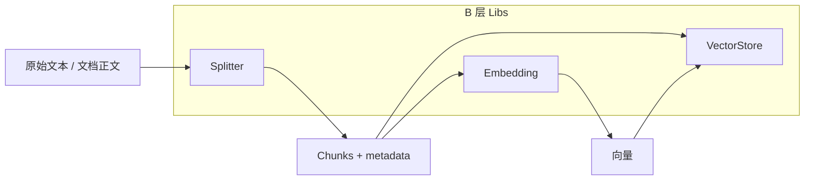
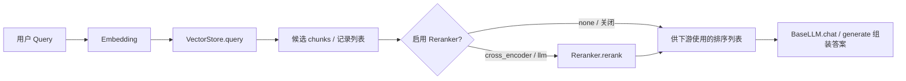

# B 层（Libs）：接口职责与工作流程

本文说明 `src/libs` 在整体架构中的定位、各子模块的**抽象接口**如何协作，以及典型的**数据/workflow**（摄取与查询）。  
B 层的目标是：**Core / Ingestion / MCP 不绑定具体厂商**，只依赖稳定抽象 + 工厂，由配置选择实现。

---

## 1. B 层在项目里扮演什么角色？

| 层次（概念） | 职责 |
|-------------|------|
| **配置** (`config/settings.yaml` + `core/settings.py`) | 决定每个 Lib 用哪个 `provider` / `backend`、模型名、URL 等。 |
| **B 层 — Libs**（本文） | 定义 **Base 接口** + **XxxFactory**，对下封装 OpenAI / Ollama / Chroma 等实现。 |
| **Core / Pipeline**（C、D 阶段等） | 编排流程：调用 Libs，组合成「摄取」「检索」「重排」「生成」等端到端能力。 |

Libs **不**负责 HTTP/MCP 协议、不定义业务级「一次查询」的完整状态机；它只回答：**给定配置，如何得到一个可调用的组件实例，以及该实例的输入输出契约是什么。**

---

## 2. 模块一览与核心契约

当前仓库中与 B 阶段强相关、已形成 **Base + Factory** 的包如下：

| 包路径 | 抽象基类（典型方法） | 工厂 | 配置对象（典型字段） |
|--------|---------------------|------|----------------------|
| `llm/` | `BaseLLM`：`generate`、`chat` | `LLMFactory` | `LLMSettings`（provider, model, api_key, …） |
| `llm/`（视觉） | `BaseVisionLLM`：`chat_with_image` 等 | `LLMFactory.create_vision_llm` | `VisionLLMSettings` |
| `embedding/` | `BaseEmbedding`：`embed(texts)` | `EmbeddingFactory` | `EmbeddingSettings` |
| `splitter/` | `BaseSplitter`：`split_text` 等 | `SplitterFactory` | `SplitterSettings`（strategy, chunk_size, …） |
| `vector_store/` | `BaseVectorStore`：`upsert`、`query` | `VectorStoreFactory` | `VectorStoreSettings` |
| `reranker/` | `BaseReranker`：`rerank(query, candidates, trace?)` | `RerankerFactory` | `RerankerSettings`（backend, model, top_k, `extra`） |
| `evaluator/` | `BaseEvaluator`：对检索结果打指标 | `EvaluatorFactory` | （依实现而定） |

**统一模式：**

1. **应用启动或构造服务时**：读取 `Settings`，为每个子域调用对应的 `XxxFactory.create(...)`，得到具体实例。  
2. **运行时**：Core 只调用 Base 上定义的方法，不 import 具体 `openai_llm.py` 等（测试里可换 mock）。

---

## 3. 组件之间的依赖与协作（不是循环依赖）

大部分 Lib **彼此独立**，可单独构造、单独测：

- **Embedding** 只依赖文本 → 向量。  
- **Splitter** 只依赖文本 → chunks。  
- **VectorStore** 只依赖向量与 metadata 的存取。  
- **Evaluator** 通常消费「query + 检索 id 列表 + 标准答案」等，不直接依赖 LLM（除非某实现内部再用 LLM）。

**例外与组合关系：**

- **`reranker` 的 `llm` 后端**  
  - 需要 **额外注入** `BaseLLM`（通过 `RerankerSettings.extra["llm"]`），因为重排要调模型读 `config/prompts/rerank.txt` 拼出的 prompt。  
  - 工厂只负责 `RerankerFactory.create(settings)`，**不会**自动替你建 LLM；由 Core 先 `LLMFactory.create_llm(...)`，再塞进 `extra`。  
- **`reranker` 的 `cross_encoder` 后端**  
  - 默认用 `sentence_transformers.CrossEncoder`；测试可注入 `extra["cross_encoder_scorer"]`（带 `predict(pairs)`）。  
- **Vision LLM**  
  - 与文本 LLM **并列**，走 `LLMFactory.create_vision_llm`，用于多模态链路（如图片描述），不替代 `BaseEmbedding`。

下面用示意图表达 **逻辑上的调用顺序**（箭头表示「数据或控制流方向」，不是 Python import 依赖）。

---

## 4. 典型工作流程 A：摄取（Ingestion）

规格中的离线链路：**文档 → 切分 →（可选元数据）→ 向量化 → 写入向量库**。  
在 Libs 视角下，对应关系如下：

要点：

- **Splitter** 输出「带文本与位置的片段」；**Embedding** 对片段文本批量算向量。  
- **VectorStore** 的 `upsert` 通常接收「id、文本、向量、metadata」等结构化记录（具体字段以 `BaseVectorStore` 契约为准）。  
- LLM / Vision LLM 在摄取里多用于 **摘要、打标签、图片 caption** 等扩展步骤，属于 Core 编排可选阶段，不是 Libs 内部硬连线。

---

## 5. 典型工作流程 B：查询（Query / RAG）

检索 + 可选重排 + 后续生成（生成在 LLM，重排在 Reranker）：

要点：

- **同一条 query** 往往先经 **Embedding** 变成查询向量，再 **VectorStore.query** 取 Top-K。  
- **Reranker** 的输入是 **`List[dict]` 候选**（至少含 `id`，通常含 `text` / score 等），输出是**重排后的同结构列表**；`llm` / `cross_encoder` 在失败时可在首条结果上带 `_rerank_fallback` 等标记，供 Core 做降级策略。  
- **Evaluator** 不在这条「在线应答」主路径上；它多用于离线或 Dashboard：**给定同一批 query 与检索结果，算 hit_rate、MRR 等**。

---

## 6. 配置如何映射到工厂（心智模型）

可以理解为一张「路由表」：

- `embedding.provider` → `EmbeddingFactory` → `OpenAIEmbedding` / `OllamaEmbedding` / …  
- `vector_store.provider` → `VectorStoreFactory` → 当前默认 `ChromaStore`。  
- `rerank.backend`（或配置里与 rerank 对应的字段）→ `RerankerFactory` → `none` / `llm` / `cross_encoder`。  
- `llm.provider` → `LLMFactory.create_llm`；视觉则 `create_vision_llm`。

**Core 的职责**（B 层之外）：把 **一份** `Settings` 拆成各 Lib 需要的 `XxxSettings`，处理 `llm` rerank 时把 LLM 实例填入 `RerankerSettings.extra`，并串联 trace、错误处理与回退。

---

## 7. 阅读代码时的推荐顺序

1. 各包的 **`base_*.py`**：认准对外契约。  
2. **`*_factory.py`**：看支持哪些 provider / backend、`register_*` 扩展点。  
3. 任选一个 **具体实现**（如 `ollama_llm.py`、`chroma_store.py`）：对照契约看配置如何进构造函数。  
4. **`reranker/`**：重点看 `llm_reranker.py`（prompt 文件、`ranked_ids` JSON）与 `cross_encoder_reranker.py`（`predict`、超时、回退）。

---

## 8. 与 DEV_SPEC 的对应关系（便于查任务）

B 阶段在规格里主要覆盖：**B1–B6 抽象与工厂**，**B7 各默认实现**，**B8–B9 Vision**。  
本文不逐条复述任务编号；当你看到规格里「某任务修改 `src/libs/...`」时，均可对照上表定位到 **哪一类可插拔组件** 以及它在 **摄取 / 查询** 哪条链路里出现。

---

*文档与当前仓库 `src/libs` 目录结构一致；若后续新增 provider，以各 `Factory` 的注册表为准。*
